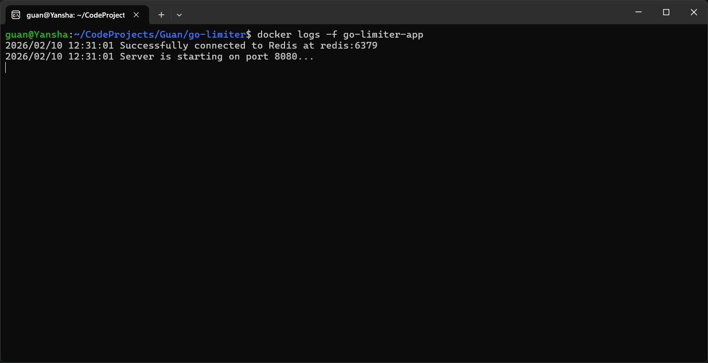
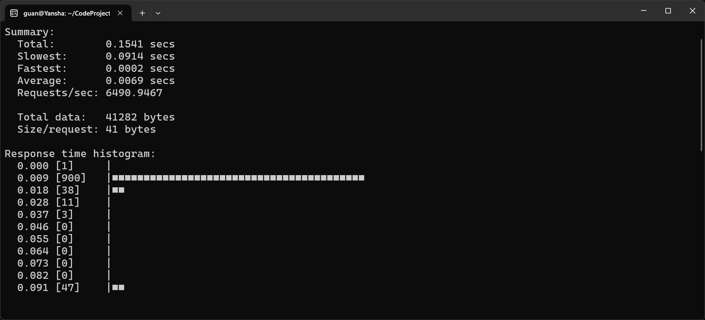
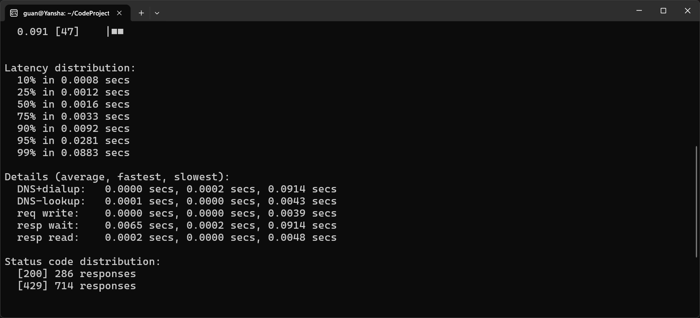
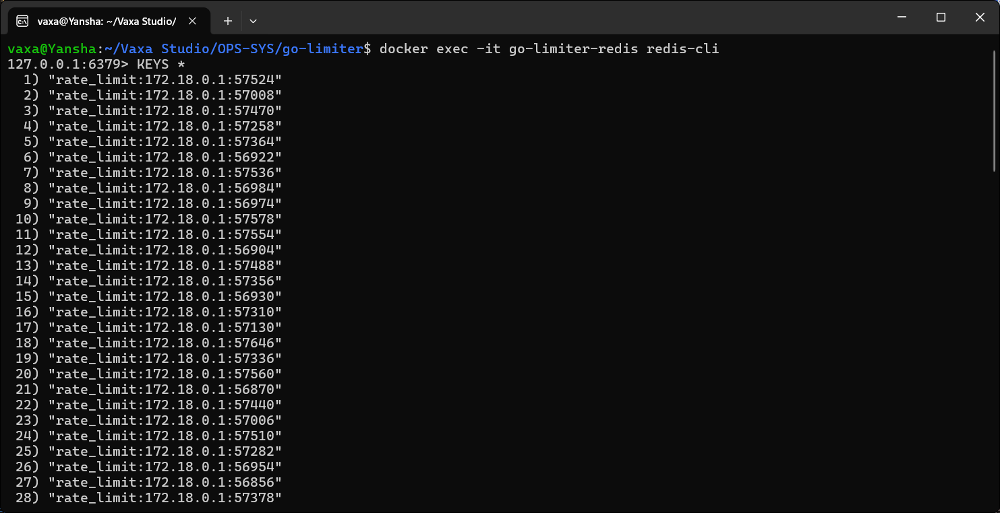
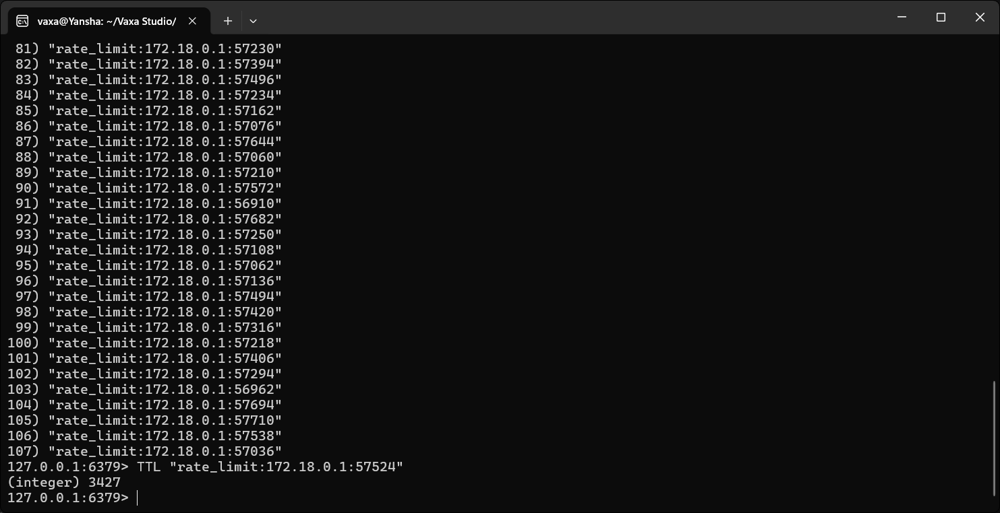

# Go Distributed Rate Limiter

A distributed rate-limiting system engineered with Go 1.24 and Redis. This project implements a middleware layer designed to throttle request throughput across distributed environments, ensuring data atomicity and consistency via Redis-backed counters.

## Technical Specifications
* **Runtime**: Go 1.24.0
* **Data Store**: Redis (Atomic Counters with TTL)
* **Orchestration**: Docker Compose (Multi-stage builds)
* **Security**: Non-root user execution and minimal attack surface via Alpine-based runtime.

## Environment Setup
Initialize the configuration by copying the environment template:
```bash
cp .env.example .env
```

## Deployment
Execute the following command to build the images and deploy the stack in detached mode:
```bash
docker compose up --build -d
```

## System Validation
Perform a basic load test to verify the middleware functionality:
```bash
for i in {1..7}; do curl -i http://localhost:8080/data; done
```

## Execution Documentation
### 1. Build and Startup Logs

Verification of the Redis pool connection initialization and HTTP server readiness.
> Command: `docker logs go-limiter-app`



### 2. Middleware Functional Test

Verification of the status code transition from HTTP 200 to HTTP 429 once the threshold is exceeded. Tested with 1,000 concurrent requests.




### 3. Redis Key-Value Persistence

Inspection of limiter data persistence and TTL mechanisms directly via the Redis engine.
> Command: `docker exec -it go-limiter-redis redis-cli KEYS "*"`




## Container Architecture
The application utilizes a multi-stage build strategy to produce an optimized static binary artifact.

1. **Stage 1 (Deps)**: Caching of Go module dependencies to accelerate build cycles.
2. **Stage 2 (Builder)**: Compilation of the binary with `-s -w` flags to strip debug information and reduce overhead.
3. **Stage 3 (Runner)**: Utilizes a hardened Alpine Linux image with strict resource limits (128MB RAM) and a non-root user (`gopher`) for secure runtime execution.